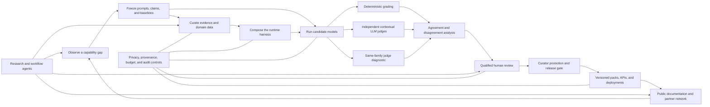

# Reusable capability-gap architecture

DueCare is one implementation of a broader pattern: find an important gap in a
general-purpose model, make the gap measurable, surround the model with verified
domain capabilities, and create a governed network that can keep those
capabilities current. The reusable product is not the trafficking-specific rule
set. It is the separation of evidence, evaluation, runtime assistance, agents,
human review, and publication.

This blueprint is for teams adapting that pattern to another industry or model
capability gap. It is an architecture and governance contract, not evidence that
the current DueCare repository already operates every box as a production
service.

## The system in one view



The arrows are deliberately one-way at promotion boundaries. A crawler, model,
email parser, or field submission can propose an update; none can silently turn
its own proposal into production truth.

## Seven planes that should remain separable

| Plane | Reusable responsibility | DueCare implementation | Boundary |
|---|---|---|---|
| Gap and claims | Define the failure, affected users, comparison arms, acceptable claims, and stopping conditions. | Benchmark prompt registries, dated research methods, claim gates, and closeout receipts. | A compelling anecdote is not a benchmark; an automated score is not human evidence. |
| Evidence and data | Acquire licensed or public evidence, retain provenance, normalize it, quarantine uncertainty, and version accepted objects. | Research-monitor configs, KnowledgeObjects, RAG corpus, entity-intelligence proposal pipeline, and source validators. | Raw cases and PII do not become shared training or retrieval data. Entity intelligence stays propose-only until curator review. |
| Runtime harness | Add domain detection, retrieval, deterministic tools, response policy, citations, and an inspectable trace around any compatible model. | `duecare.chat.harness`, registered workbench harnesses, GREP, RAG, tools, and model adapters. | Models reason and draft; versioned objects and tools own volatile facts. |
| Evaluation | Run paired controls, deterministic scoring, cross-family contextual judges, self-family diagnostics, robustness tests, and disagreement queues. | Candidate and judge runners, universal rubric, rich-harness lift, multi-judge surfaces, and the Kimi/Gemini campaign manifest. | Same-family judging is reported separately. Holistic judging is directional; per-dimension judging is the publication-grade protocol. |
| Human governance | Obtain qualified ratings, adjudicate disagreements, review sources and rights, approve releases, and record uncertainty. | Human-validation packet builder, outreach drafting, curator queues, and promotion rules. | Prepared packets and drafted outreach are not participation. Current DueCare status remains zero independent human ratings. |
| Network and publication | Share sanitized signals, vetted pack metadata, reproducible notebooks, public status, APIs, and continuity artifacts. | DueCare hub, GitHub/MkDocs Pages, Kaggle surfaces, anonymized signal APIs, and continuity-site export. | The network shares reviewed knowledge and aggregate signals, not raw worker narratives or contact lists. |
| Agent and operations | Schedule discovery, triage, delivery adapters, review queues, monitoring, budgets, and recovery without giving bots promotion authority. | Hermes proposal generator, server automation, autonomous-engine controls, recurring-task sentinels, and provider ledger. | Actual daemons are currently host-scheduled and disabled; the runtime and hub are containerizable, but current agents are not claimed as containerized outreach services. |

## The reusable lifecycle

### 1. State a falsifiable capability gap

Write the gap as a behavior that can be observed on a fixed input. Include the
affected user, the harm of failure, benign neighboring behavior that must be
preserved, and the evidence needed to call the gap closed.

Good gap contract:

> On a frozen set of ambiguous recruitment-fee prompts, measure whether the
> candidate recognizes worker-paid fee risk, avoids operational enablement,
> grounds material claims, and gives safe action steps without over-refusing
> legitimate worker questions.

The same shape works for a financial-model filing gap, a clinical-coding
coverage gap, a construction-safety document gap, a multilingual public-service
gap, or a software-agent tool-use gap. The rubric and evidence change; the
control structure does not.

### 2. Freeze the measurement before changing the system

Record:

- prompt IDs, text hashes, categories, languages, difficulty, and sampling seed;
- candidate model IDs, endpoints, decoding settings, context limits, and dates;
- baseline and harness arms;
- deterministic rubric version and applicability rules;
- judge model, family, context bundle, prompt, and rubric hashes;
- attempt, input-token, output-token, and cash ceilings; and
- the exact claims the run can and cannot support.

Every hosted call must be resumable and budgeted. Every result row should bind
the candidate response, context, rubric, judge prompt, and judge relationship by
hash. Failed calls are access or transport evidence, not failed model answers.

### 3. Build evidence as typed, reviewable objects

A portable domain pack should contain at least:

```text
domain-pack/
  domain.yaml                 # purpose, users, risks, exclusions, owners
  source_registry.yaml        # URL/authority/license/snapshot/freshness
  indicators.json             # deterministic signals and citations
  retrieval_corpus.jsonl      # bounded, provenance-bearing excerpts
  tools.yaml                  # deterministic lookups and volatility class
  rubric.json                 # dimensions, applicability, anchors
  prompts.jsonl               # adversarial, benign, multilingual, controls
  escalation.yaml             # human roles, urgency, jurisdiction limits
  privacy_and_rights.yaml     # PII, consent, retention, licensing
  release_manifest.json       # hashes, versions, approvals, test receipt
```

Training examples are a separate derivative. Stable reasoning patterns may be
taught; current phone numbers, deadlines, fee caps, office names, and other
volatile facts should remain in versioned packs or deterministic tools.

### 4. Compose capabilities around, not inside, the model

The model adapter should be replaceable. The harness composes capabilities in a
traceable order:

```text
local input checks
  -> domain/intent signals
  -> retrieval from accepted evidence
  -> deterministic tool calls
  -> bounded response policy
  -> candidate model
  -> output checks and citations
  -> trace/export
```

This makes the research question portable: the same prompt and harness can be
tested around Gemma, Kimi, Gemini, a local open model, or a future provider. It
also lets deterministic functions remain available when no model is loaded.

### 5. Triangulate evaluation

No single grader is ground truth.

| Signal | Strength | Known weakness | Reporting rule |
|---|---|---|---|
| Deterministic rubric | Free, exact reruns, easy regression gate. | Surface-form and applicability errors; can miss semantic quality. | Report as the reproducible floor/cross-check. |
| Cross-family contextual LLM judge | Reads the full answer with the same versioned evidence available to the study. | Model bias, prompt sensitivity, non-determinism, shared training-data assumptions. | Primary automated view only when judge family is independent of the candidate; hash context and rubric. |
| Same-family/self judge | Useful for measuring self-preference and understanding model-specific disagreement. | Independence is absent. | Keep in a separate diagnostic lane; never headline it as independent validation. |
| Qualified human adjudication | Can assess real usefulness, local context, and rubric errors. | Cost, reviewer burden, expertise and sampling bias. | Publish reviewer qualifications, protocol, missingness, agreement, and uncertainty. |

For a broad directional run, one structured holistic call per answer can return
an overall score and several dimensions. For a publication-grade dimension
claim, use one dedicated call per dimension so the judge cannot trade one
criterion against another. Route the largest disagreements to humans instead of
silently averaging them away.

### 6. Use agents as proposers and routers

The reusable agent plane can include four roles:

1. **Research agent** — watches public sources, detects stale coverage, and
   stages source or prompt proposals.
2. **Workflow bus / server automation** — deduplicates, routes, retries, and
   records proposal state.
3. **Delivery adapter** — drafts or, only under a separately authorized consent
   system, sends questions and receives replies.
4. **Curator/reviewer interface** — shows provenance, conflicts, privacy flags,
   ratings, and promotion controls to a human.

In this repository, `scripts/hermes.py` means a propose-only synthetic research
daemon. It does not send email or collect civil-society ratings. A separate
Hermes mail adapter appears only in the outreach reference design.

<!-- audit-allow:drift reason: documents the compatibility name and maps it to the canonical component -->
The legacy **OpenClaw**-compatible daemon/routes belong to the canonical
**server automation** role. They are workflow infrastructure, not an authority
that may approve evidence. The public `/api/hub/opencrawl/updates` route is a
Public Information Research Monitor proposal endpoint and is a third, distinct
concept. A replica should not collapse these names into one autonomous bot.

### 7. Build the network effect without centralizing harm

The safe network loop is:

```text
local/private case or public source
  -> local minimization and anonymization
  -> structured proposal
  -> server-side PII rejection
  -> curator and rights review
  -> evaluation gate
  -> signed/versioned release metadata
  -> public pack index or partner deployment
  -> aggregate gap signal back to maintainers
```

Public presentation matters because it makes the system inspectable and easier
to join. A durable replica should publish a plain-language website, technical
architecture, status/limitations page, reproducible notebooks or examples,
schemas, release hashes, and a maintainer handoff. The public story must follow
the evidence state: “proposal intake exists” is different from “a partner
network is active,” and “a review packet exists” is different from “humans rated
it.”

## Generic service topology

The pattern supports multiple deployment shapes:

| Service | Container-friendly target | Offline/local option | Promotion authority |
|---|---|---|---|
| Model runtime and harness API | Stateless or GPU container with mounted versioned packs. | Local process, on-device runtime, or notebook. | None. |
| Public hub / exchange | Web/API container with PII rejection and metadata stores. | Static documentation and read-only pack export. | None; accepts proposals only. |
| Research monitor | Scheduled worker container or host task. | One-shot CLI over public snapshots. | None. |
| Workflow automation | Queue worker plus durable proposal/audit store. | Host-scheduled script and SQLite. | None. |
| Human review | Authenticated review application. | Exported review packet and controlled spreadsheet/tool. | Named qualified reviewers and curator only. |
| Release builder | CI job producing hashes, manifests, packages, and docs. | Reproducible local command. | Protected approval/tag policy. |

DueCare's current truth is narrower: its runtime and hub have container paths;
Hermes, server automation, the orchestrator, and autonomous engine are
host-scheduled and disabled. A future container design should preserve that
honest status distinction until deployment receipts prove otherwise.

## What transfers and what must be rebuilt

Transfers across industries:

- hash-bound prompt and result contracts;
- provider-neutral model adapters and atomic budgets;
- deterministic + cross-family + self-family + human evaluation separation;
- GREP/RAG/tool harness composition and trace exports;
- proposal-only agents and curator promotion gates;
- anonymized signal exchange, versioned pack manifests, and public status pages;
- offline notebooks, source validators, handoff, and continuity deployment.

Must be rebuilt and reviewed for each industry:

- definitions of harm, capability, intent, and acceptable refusal;
- authoritative source registry and licensing rights;
- indicator rules, retrieval excerpts, deterministic tools, and escalation paths;
- rubric applicability and anchors;
- benign controls, multilingual coverage, and affected-user sampling;
- privacy, retention, professional-duty, and jurisdiction rules; and
- reviewer qualifications and release authority.

Copying DueCare's trafficking rules into another vertical without this rebuild
would create a superficially complete but invalid system.

## Minimum viable replica and maturity ladder

| Level | Required evidence |
|---|---|
| L0 — gap hypothesis | Written claims boundary, small frozen prompt/control set, and deterministic baseline. |
| L1 — reproducible evaluator | Hash-bound candidate outputs, deterministic grades, no-call plan, finite budgets, and a report that names limitations. |
| L2 — grounded harness | Versioned sources, retrieval, deterministic tools, paired baseline/harness run, and inspectable traces. |
| L3 — independent automated review | Cross-family contextual judge, self-family diagnostic, agreement analysis, robustness checks, and disagreement queue. |
| L4 — governed human evidence | Qualified reviewers, consent/rights protocol, adjudication, agreement/uncertainty, and recorded promotion decisions. |
| L5 — maintained network | Proposal-only research/partner agents, privacy-safe exchange, versioned releases, deployment receipts, monitoring, revocation, and named owners. |

A system may be useful at L1 or L2. It should not market itself as L4 or L5
because the architecture diagram contains those boxes.

## Replica acceptance checklist

- [ ] The gap and prohibited claims are written before the first paid run.
- [ ] Prompts include adversarial, benign-neighbor, multilingual, and
  affected-user views where applicable.
- [ ] Sources have authority, date, license/rights, snapshot, and freshness
  metadata.
- [ ] Volatile facts come from versioned tools/packs, not model memory or SFT.
- [ ] Every provider path has finite attempts, input, output, and cash budgets.
- [ ] Results are resumable and bind response, context, rubric, judge, and code
  revision.
- [ ] Independent and self-family judges are separated.
- [ ] Automated scores are never described as human ratings.
- [ ] Agents propose and route; named humans approve promotion.
- [ ] Raw sensitive data stays local unless an authorized, minimized submission
  is explicitly created.
- [ ] Public pages state current status, limitations, owners, and exact pickup
  instructions.
- [ ] A static/read-only continuity site survives loss of the mutable hosting
  service.

## DueCare files that instantiate the pattern

- Harness inventory and boundaries: [`../harness_ecosystem.md`](../harness_ecosystem.md)
- Component map: [`README.md`](README.md)
- Information-sharing design: [`../information_sharing_architecture.md`](../information_sharing_architecture.md)
- Provider budgets: [`../PROVIDER_BUDGETING.md`](../PROVIDER_BUDGETING.md)
- Human/outreach boundary: [`../deployment/oracle_email_solicitation.md`](../deployment/oracle_email_solicitation.md)
- Current status: [`../project_status.md`](../project_status.md)
- Maintainer pickup: [`../MAINTAINER_HANDOFF.md`](../MAINTAINER_HANDOFF.md)
- Kimi/Gemini campaign manifest: [`../../configs/duecare/benchmarks/kimi_k3_500_context_judge_campaign.json`](../../configs/duecare/benchmarks/kimi_k3_500_context_judge_campaign.json)

The architecture is reusable because these contracts are explicit. The domain
knowledge remains replaceable, the model remains replaceable, and no automated
component is allowed to promote its own output into truth.
