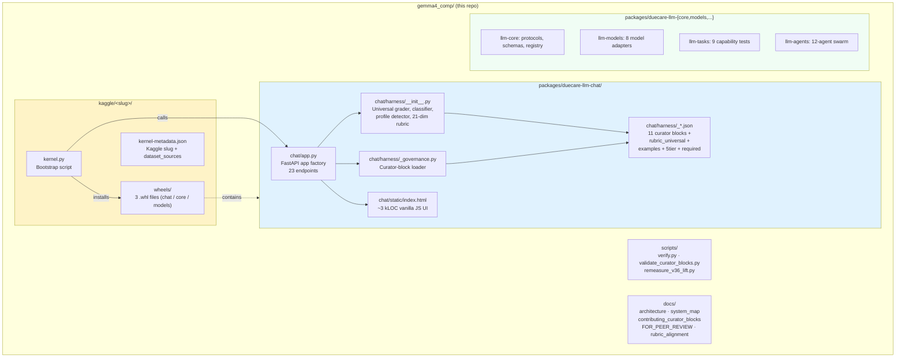

# Component diagram — how the parts deploy and communicate

> Single-page ERD of every Duecare component, the data each holds,
> the API surface each exposes, and the wire path between them. Pairs
> with `system_map.md` (which is user→surface oriented). This doc
> is **server-internals oriented**.

## Three views

1. **Static structure** — what exists in the repo + what ships in the wheel
2. **Runtime topology** — what runs where + which port/IP it listens on
3. **Request flow** — the path of a chat / grade / classify call end-to-end

---

## View 1: static structure



**What ships in the wheel** (`duecare_llm_chat-0.2.1-py3-none-any.whl`):

```
duecare/
├── chat/
│   ├── __init__.py        # exports create_app, run_server
│   ├── app.py             # FastAPI app + 23 endpoints
│   ├── harness/
│   │   ├── __init__.py    # Grader + classifier + profile detector
│   │   ├── _governance.py # Curator-block loader
│   │   ├── _rubric_universal.json     # 21 dims
│   │   ├── _evaluation_questions.json # 21 evaluator q+hint
│   │   ├── _classifier_signals.json   # 194 entries, 11 langs
│   │   ├── _usecase_affinity.json     # 7 use-cases × dim weights
│   │   ├── _intent_affinity.json      # 5 intents × dim weights
│   │   ├── _intent_signals.json       # response-side detection
│   │   ├── _authoritative_statutes.json   # 144 jurist allowlist
│   │   ├── _known_statute_sections.json   # 55 §/Art. ranges
│   │   ├── _country_hints.json        # 25 corridor countries
│   │   ├── _grader_config.json        # 14 thresholds + 4 flags
│   │   ├── _baseline_gauge.json       # stock 6% / harnessed 88%
│   │   ├── _rubric_hints.json         # 21 dim PASS/FAIL UI hints
│   │   ├── _examples.json             # 413 example prompts
│   │   ├── _classifier_examples.json  # 54 classifier samples
│   │   ├── _rubrics_5tier.json        # 207 hand-graded prompts
│   │   └── _rubrics_required.json     # 6 category rubrics
│   └── static/
│       └── index.html     # vanilla JS chat UI
```

---

## View 2: runtime topology (the 5 deployment shapes)

```
┌──────────────────────────────────────────────────────────────────┐
│  TOPOLOGY A: Kaggle kernel (current submission target)           │
│                                                                  │
│   ┌─────────────────────────────────────────────────────┐        │
│   │  Kaggle worker (T4 GPU)                              │        │
│   │  ┌─────────────────────┐    ┌────────────────────┐  │        │
│   │  │  Gemma 4 model       │←─→│  FastAPI app       │  │        │
│   │  │  (Unsloth FastModel) │    │  (uvicorn :7860)   │  │        │
│   │  │  E4B / 31B / cloud   │    │  + harness layers  │  │        │
│   │  └─────────────────────┘    └─────────┬──────────┘  │        │
│   │                                        │             │        │
│   │  ┌──────────────────────────────────┐ │             │        │
│   │  │  cloudflared (quick tunnel)       │←┘             │        │
│   │  └──────────┬───────────────────────┘                │        │
│   └──────────────┼────────────────────────────────────────┘        │
│                  │ public *.trycloudflare.com URL                  │
│                  ↓                                                 │
│           ┌──────────────┐                                         │
│           │  Browser     │  ← user's laptop / phone                │
│           └──────────────┘                                         │
└──────────────────────────────────────────────────────────────────┘

┌──────────────────────────────────────────────────────────────────┐
│  TOPOLOGY B: Local laptop (developer)                            │
│                                                                  │
│   ┌─────────────────────────────────────────────────────┐        │
│   │  developer laptop                                    │        │
│   │  ┌─────────────────────┐    ┌────────────────────┐  │        │
│   │  │  Ollama (gemma4:e2b) │←─→│  FastAPI app        │  │        │
│   │  │  :11434              │    │  :8080              │  │        │
│   │  └─────────────────────┘    └─────────┬──────────┘  │        │
│   │                                        │             │        │
│   │  Browser  ←── http://localhost:8080 ──┘             │        │
│   └─────────────────────────────────────────────────────┘        │
└──────────────────────────────────────────────────────────────────┘

┌──────────────────────────────────────────────────────────────────┐
│  TOPOLOGY C: HuggingFace Space (planned stable URL)              │
│                                                                  │
│   ┌─────────────────────────────────────────────────────┐        │
│   │  HF Space (CPU or GPU, persistent)                   │        │
│   │  ┌─────────────────────┐    ┌────────────────────┐  │        │
│   │  │  Gemma 4 (HF Hub)    │←─→│  FastAPI app        │  │        │
│   │  └─────────────────────┘    └─────────┬──────────┘  │        │
│   │                                        │             │        │
│   └──────────────────────────────────────┬─┘             │        │
│                                           │               │        │
│             https://taylorscottamarel-duecare.hf.space   │        │
│                                           ↓                        │
│                                    ┌──────────────┐                │
│                                    │  Browser     │                │
│                                    └──────────────┘                │
└──────────────────────────────────────────────────────────────────┘

┌──────────────────────────────────────────────────────────────────┐
│  TOPOLOGY D: Android (Duecare Journey, sibling repo)             │
│                                                                  │
│   ┌─────────────────────────────────────────────────────┐        │
│   │  Worker's phone                                      │        │
│   │  ┌─────────────────────┐    ┌────────────────────┐  │        │
│   │  │  MediaPipe Gemma 4   │←─→│  Kotlin UI         │  │        │
│   │  │  (LiteRT, on-device) │    │  + SQLCipher       │  │        │
│   │  └─────────────────────┘    │  encrypted journal │  │        │
│   │                              └────────────────────┘  │        │
│   │       NO NETWORK after install. Privacy non-negotiable. │
│   └─────────────────────────────────────────────────────┘        │
└──────────────────────────────────────────────────────────────────┘

┌──────────────────────────────────────────────────────────────────┐
│  TOPOLOGY E: NGO office edge box (planned)                       │
│                                                                  │
│   ┌─────────────────────────────────────────────────────┐        │
│   │  Mac mini / NUC at NGO office                        │        │
│   │  ┌─────────────────────┐    ┌────────────────────┐  │        │
│   │  │  Ollama / llama.cpp  │←─→│  FastAPI app        │  │        │
│   │  └─────────────────────┘    └─────────┬──────────┘  │        │
│   │                                        │             │        │
│   │  ┌────────────────────────────────────┴──────┐      │        │
│   │  │  LAN (caseworker laptops + tablets)        │      │        │
│   │  └────────────────────────────────────────────┘      │        │
│   │  No internet at runtime. Caseworker data stays in NGO. │
│   └─────────────────────────────────────────────────────┘        │
└──────────────────────────────────────────────────────────────────┘
```

---

## View 3: request flow (one chat round-trip)

```
USER                         BROWSER UI                       FASTAPI APP                          HARNESS                    GEMMA 4
  │                              │                                 │                                  │                          │
  │  types message               │                                 │                                  │                          │
  │ ─────────────────────────→   │                                 │                                  │                          │
  │                              │  POST /api/chat/send            │                                  │                          │
  │                              │  {messages, toggles, generation}│                                  │                          │
  │                              │ ──────────────────────────────→ │                                  │                          │
  │                              │                                 │  _run_harness(messages, toggles) │                          │
  │                              │                                 │ ───────────────────────────────→ │                          │
  │                              │                                 │                                  │  if toggles.persona:     │
  │                              │                                 │                                  │    prepend DEFAULT_PERSONA│
  │                              │                                 │                                  │  if toggles.grep:         │
  │                              │                                 │                                  │    grep_call(text)        │
  │                              │                                 │                                  │  if toggles.rag:          │
  │                              │                                 │                                  │    rag_call(text, k=5)   │
  │                              │                                 │                                  │  if toggles.tools:        │
  │                              │                                 │                                  │    tools_call(messages)  │
  │                              │                                 │                                  │  if toggles.online:       │
  │                              │                                 │                                  │    online_search_call(q) │
  │                              │                                 │                                  │  build harness_text +     │
  │                              │                                 │                                  │   prepend to user msg     │
  │                              │                                 │ ←──────────────────────────────  │                          │
  │                              │                                 │  with _GEMMA_LOCK:               │                          │
  │                              │                                 │   gemma_call(messages, gen)      │                          │
  │                              │                                 │ ──────────────────────────────────────────────────────────→ │
  │                              │                                 │                                  │                          │  generate
  │                              │                                 │                                  │                          │  (~30s E4B)
  │                              │                                 │ ←────────────────────────────────────────────────────────── │
  │                              │   SSE stream w/ keepalives      │                                  │                          │
  │                              │ ←─────────────────────────────  │                                  │                          │
  │                              │   final {response, harness_trace,│                                 │                          │
  │                              │     elapsed_ms, model_info}     │                                  │                          │
  │                              │                                 │                                  │                          │
  │  ─── chat renders ───        │                                 │                                  │                          │
  │  ─── BACKGROUND ──────────────────────────                     │                                  │                          │
  │                              │  POST /api/grade (mode=universal)                                  │                          │
  │                              │  {response, prompt, harness_trace}                                  │                          │
  │                              │ ──────────────────────────────→ │                                  │                          │
  │                              │                                 │  classify_prompt(prompt)         │                          │
  │                              │                                 │ ───────────────────────────────→ │                          │
  │                              │                                 │                                  │  rule-layer scan         │
  │                              │                                 │                                  │  (no LLM call)           │
  │                              │                                 │ ←──────────────────────────────  │                          │
  │                              │                                 │  grade_response_universal(...)   │                          │
  │                              │                                 │ ───────────────────────────────→ │                          │
  │                              │                                 │                                  │  for dim in 21:           │
  │                              │                                 │                                  │   - applicability check  │
  │                              │                                 │                                  │   - keyword/cluster/     │
  │                              │                                 │                                  │     trigram match        │
  │                              │                                 │                                  │   - usecase_mult         │
  │                              │                                 │                                  │  citation_check          │
  │                              │                                 │                                  │  section_check           │
  │                              │                                 │                                  │  structure detection     │
  │                              │                                 │                                  │  gaming defense          │
  │                              │                                 │ ←──────────────────────────────  │                          │
  │                              │   {pct_score, dimensions[],     │                                  │                          │
  │                              │    classification, signals}     │                                  │                          │
  │                              │ ←─────────────────────────────  │                                  │                          │
  │  ─── chips render below msg ─│                                 │                                  │                          │
```

---

## API surface (23 endpoints)

| Verb | Path | Purpose | Caller |
|---|---|---|---|
| GET | `/` | Serves `static/index.html` | Browser |
| GET | `/healthz` | Liveness probe | Health check |
| GET | `/api/health-check` | Comprehensive smoke check | curl |
| GET | `/api/version` | One-call audit of versions + counts | External tools |
| GET | `/api/model-info` | Loaded model display info | Browser |
| GET | `/api/harness-info` | Wired-layer state | Browser at boot |
| GET | `/api/examples` | Bundled prompt library (413) | Browser |
| GET | `/api/docs/{layer}` | Per-layer extension guide markdown | Browser modal |
| GET | `/api/governance` | Curator-block index | Browser inspector |
| GET | `/api/governance/{name}` | Full curator JSON | External tools |
| GET | `/api/baseline` | Stock vs harnessed reference numbers | Browser gauge |
| GET | `/api/rubric-hints` | Per-dim PASS/FAIL UI hints | Browser grade modal |
| GET | `/api/evaluation-questions` | Per-dim evaluator q+hint catalog | External tools |
| GET | `/api/harness-catalog/{layer}` | What each layer exposes | Browser inspector |
| POST | `/api/chat/send` | Generate chat response (SSE) | Browser |
| POST | `/api/chat/upload-image` | Stash image, return id | Browser multimodal |
| GET | `/api/chat/image/{sid}` | Retrieve stashed image | Browser preview |
| POST | `/api/grade` | Universal/Expert/category grader | Browser auto-chips + Grade modal |
| POST | `/api/grade-deep` | LLM-evaluator grader (slow, ~21 calls) | Browser Grade modal Evaluator mode |
| POST | `/api/grade-combined` | Universal + Evaluator blend | Browser Grade modal Combined mode |
| POST | `/api/classify-prompt` | Run classifier on arbitrary prompt | External tools |
| POST | `/api/ablation` | 4-way layer ablation runner | Browser ▸ Run ablation link |
| POST | `/api/load-model` | Load a Gemma variant (kernel-side) | Browser picker overlay |

---

## Data flow contract

Every chat round-trip carries one **`harness_trace`** dict that
shadow-tracks what each layer did:

```json
{
  "persona": {"enabled": true,  "wired": true,  "fired": true,
              "elapsed_ms": 0, "text_preview": "...", "summary": "..."},
  "grep":    {"enabled": true,  "wired": true,  "fired": true,
              "elapsed_ms": 12, "hits": [{"rule": "...", "citation": "...",
                                            "severity": "...", "match_excerpt": "..."}]},
  "rag":     {"enabled": true,  "wired": true,  "fired": true,
              "elapsed_ms": 34, "docs": [{"id": "...", "title": "...",
                                            "snippet": "...", "source": "..."}]},
  "tools":   {"enabled": false, "wired": true,  "fired": false},
  "online":  {"enabled": false, "wired": false, "fired": false}
}
```

The trace is:
1. Built by `_run_harness()` server-side
2. Returned in `/api/chat/send` payload
3. Passed back to `/api/grade` for citation grounding
4. Rendered in the Pipeline modal
5. Pinned to the eval row for reproducibility (`(model, git_sha, dataset_version)`)

---

## Curator-block read path

```
load → app boot                   load → per-request (no cache)
─────────────────────             ─────────────────────────────
RUBRIC_UNIVERSAL  ◀─ static       /api/governance        ◀─ live
EVALUATION_QUESTIONS              /api/governance/{name}
USECASE_DIMENSION_AFFINITY        /api/baseline
INTENT_DIMENSION_AFFINITY         /api/rubric-hints
_USECASE_RULE_SIGNALS             /api/evaluation-questions
_AUTHORITATIVE_STATUTES_ALLOWLIST
KNOWN_STATUTE_SECTIONS
_COUNTRY_HINTS
_INTENT_SIGNALS_BY_INTENT
_GRADER_CFG (thresholds + flags)
```

The 8 module-level constants are loaded **once at module import**
from the curator JSONs. The 5 endpoints serve the JSON live so an
external client can audit the deployed values without restarting
the kernel.

---

## Cross-references

- User-perspective view: [`system_map.md`](system_map.md)
- 5 deployment topologies in detail: [`deployment_topologies.md`](deployment_topologies.md)
- Three deployment modes (enterprise / worker / NGO): [`deployment_modes.md`](deployment_modes.md)
- Architecture deep dive (2046 lines, agent-level): [`architecture.md`](architecture.md)
- How to extend each component: [`maintenance/`](maintenance/) (per-component guides)
- How to PR a curator JSON edit: [`contributing_curator_blocks.md`](contributing_curator_blocks.md)
- Track + rubric alignment: [`rubric_alignment.md`](rubric_alignment.md)
