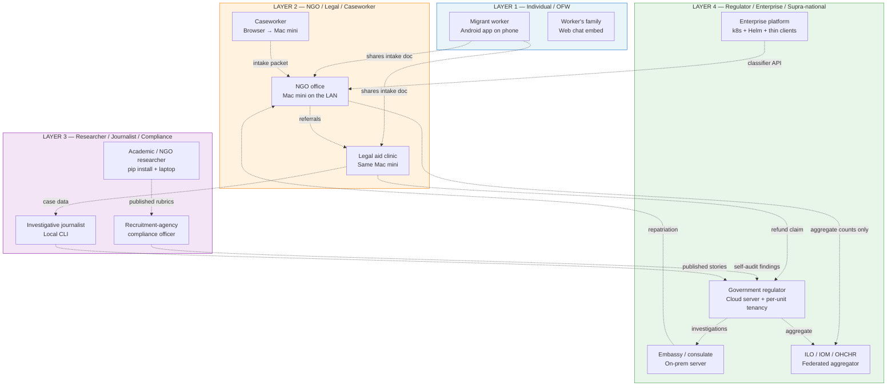
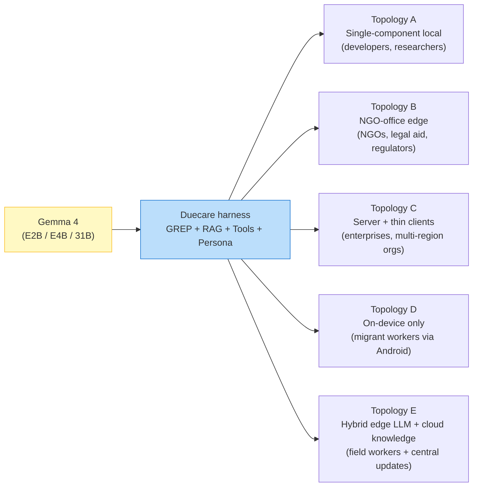
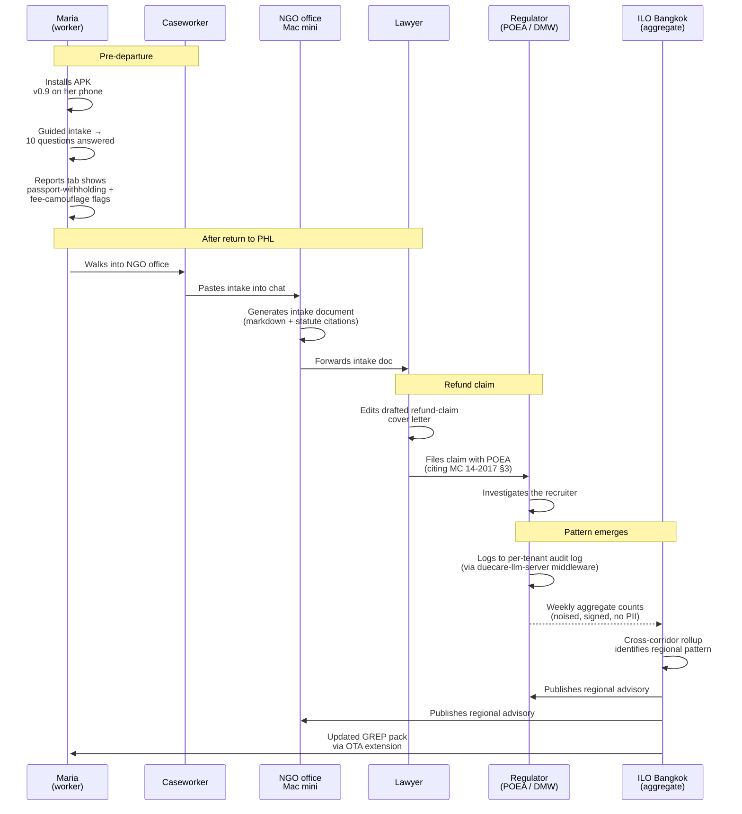
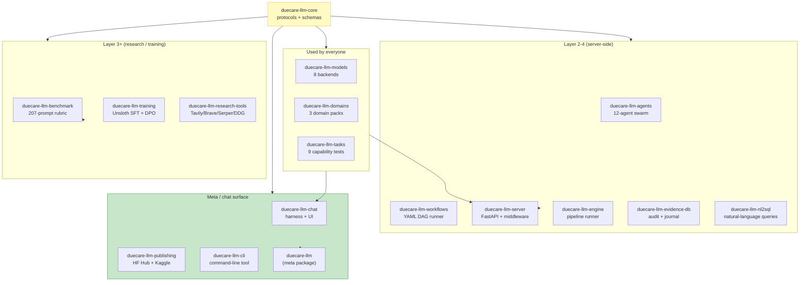

# The Duecare ecosystem — one harness, four user layers

> **The 30-second pitch.** A single content-safety harness, layered
> around Google Gemma 4, deployable from a worker's phone to a
> Big Tech enterprise. The same code spots a recruitment fraud the
> day a worker pays the fee, drafts the refund-claim packet a
> lawyer files three months later, surfaces the pattern a regulator
> investigates a year later, and feeds the regional report an ILO
> office publishes the year after that.

## The 4-layer ecosystem

The same harness logic runs at every layer. What changes is the
**deployment shape** (Topology A, B, C, D, or E from
[deployment_topologies.md](deployment_topologies.md)) and the
**workflow** (per-persona walkthrough in
[scenarios/](scenarios/README.md)).

## The same harness, served differently

A NGO can run Topology B for their office + recommend Topology D
to the workers they serve + contribute aggregate counts to a
Topology C federation aggregator — all using the same source code.

## The data flow — Maria's case

Every arrow in this diagram is enabled by code that ships today.
The privacy boundary holds at every step (worker's PII never
leaves her phone unless she shares the intake doc; NGO's
contributions to ILO are noised aggregate counts only).

## The 17 PyPI packages — what each layer needs

A migrant worker uses zero PyPI packages directly (the Android
app bundles its own Kotlin port of the harness). A researcher
uses 4-5 (`core` + `chat` + `tasks` + `domains` + sometimes
`benchmark`). An enterprise uses 12+ for a full deployment.
Everyone gets the same harness logic — just different surface
areas.

## Why this composition works

**Privacy travels with the user.** A worker's data lives on her
phone. An NGO's data lives on the office Mac mini. A regulator's
data lives in their VPC. The federation protocol shares only
noised aggregate counts. **No data leaves the layer that owns it
without an explicit user action.**

**Same primitives, different deployments.** A new GREP rule added
to detect a corridor-specific pattern lands once + propagates to
every layer through the extension-pack format. A new corridor
profile lands once + every persona's chat surface knows about it
the next session.

**Open source binds the trust chain.** Every layer can audit every
other layer's source code. The Android app's harness is a Kotlin
port of the Python harness; both are public. The federation
aggregator's source is public. There's no closed component
anywhere that an organization is asked to trust on faith.

**Open standards bind the data.** Every layer speaks OpenAPI 3
(REST), Prometheus (metrics), OpenTelemetry (traces), JSON
(audit). No proprietary protocols. An organization adopting
Duecare can swap any one component for an alternative that
speaks the same standard.

## The four-layer adoption path

A real-world adoption sequence — what we've seen work for similar
tools (Tella by Horizontal, Polaris's data architecture, Anti-
Slavery International's open-source initiatives):

| Phase | Months | Who adopts first | What unlocks next |
|---|---|---|---|
| Phase 1 | 1-3 | Individual researchers + journalists | Public reproducibility + press coverage |
| Phase 2 | 3-9 | NGOs (1-5 pilot deployments) | Real workflow validation + caseworker testimonials |
| Phase 3 | 9-18 | Government regulators (initial unit-level adoption) | Policy-level validation + budget allocation |
| Phase 4 | 18-36 | Enterprises (recruitment platforms, social media moderation) | Cross-cutting integration |
| Phase 5 | 36+ | ILO / IOM / supra-national federation | Regional pattern aggregation, multi-NGO coordination |

Duecare is currently at the **start of Phase 1**. The 6+5 Kaggle
notebooks + the published documentation are the Phase 1 adoption
surface. The Android app is the Phase 1.5 surface (workers can
adopt directly).

## What "max impact + max audience" looks like in practice

If everything works as designed:

- A migrant worker in Hong Kong installs the APK before her flight
  back to Manila. She hands her case to her local NGO with the
  intake doc pre-generated.
- The NGO's Mac mini handles 5-15 cases / day with no
  subscription cost.
- The NGO's caseworker recovers 2 hours of legal-research time
  per intake. They handle more cases.
- The NGO contributes aggregate counts to a regional federation
  aggregator. ILO Bangkok publishes a regional report identifying
  a new fee-camouflage pattern across 12 NGOs in PH-HK + ID-HK.
- POEA enforcement responds to the aggregate signal. The
  recruiter at the center of the pattern gets investigated.
- An enterprise platform adopting Duecare's classifier flags
  the same recruiter's job ads on their platform. The pattern
  gets cut off at the source.
- A journalist publishes the pattern story using the
  press kit + Duecare's reproducible methodology. Public pressure
  closes the corridor of the specific abuse.
- An ILO regional office documents the closure in its annual
  report. Other corridors learn from the pattern.

That's the loop. Every step uses the same harness, the same
domain pack, the same audit-log schema, the same observability
stack. Different topology, different persona, same code.

## Adoption mechanics — what advances each layer

| Layer | What advances it | What blocks it |
|---|---|---|
| Layer 1 (workers) | Translated UI + Play Store / F-Droid distribution + worker-community endorsements | Lack of awareness; recruiter retaliation if found |
| Layer 2 (NGOs) | First 3-5 reference deployments + their public testimonials | NGO IT capacity; budget for hardware ($250-800) |
| Layer 3 (researchers / journalists) | Reproducibility of headline numbers + press kit usage | Citation discipline; verification of claims |
| Layer 4 (regulators / enterprises / ILO) | Initial unit-level pilot + cross-NGO federation pilot | Procurement cycles; vendor-questionnaire reviews |

Right now (May 2026, hackathon submission window):
- Layer 3 has the most immediate traction (notebooks + writeup
  + press kit ship today)
- Layer 1 has the working app but needs distribution channels
- Layer 2 is unblocked technically; needs first NGO reference
- Layer 4 is design-complete; needs first organizational pilot

## Adjacent reads

- [Try in 2 minutes](try_in_2_minutes.md) — per-persona quickstart
- [Deployment topologies](deployment_topologies.md) — the 5 deployment shapes
- [Scenarios index](scenarios/README.md) — 14 persona walkthroughs
- [Cross-NGO trends federation](cross_ngo_trends_federation.md) — the privacy-preserving aggregation protocol
- [Press kit](press_kit.md) — facts + quotes + story angles
- [Comparison vs alternatives](comparison_to_alternatives.md) — when Duecare fits vs not
