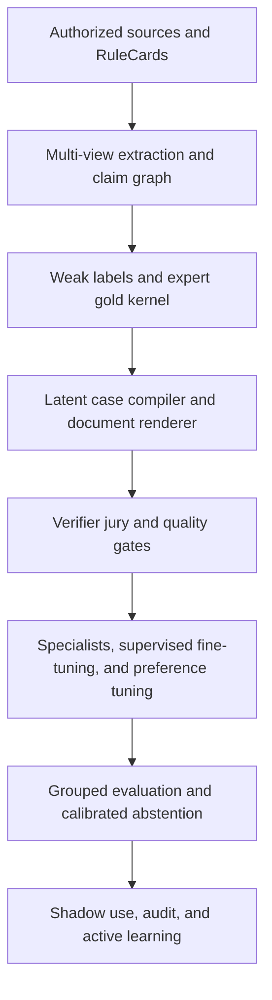

# DueCare evidence-grounded synthetic-training blueprint

Last reviewed: 2026-07-15

Status: architectural blueprint and research plan. This document does not, by
itself, establish that a model has been trained, that a model has improved, or
that any system is suitable for consequential decisions about a person.

Companion documents:

- [Training-dataset publication and safety-evaluation practices](training_dataset_publication_and_safety_practices.md)
- [Training data and fine-tuning](../training_and_finetuning.md)
- [Training regimes and systems](training_regimes_and_systems.md)
- [Four-arm evaluation](four_arm_eval.md)

## Terms used in this blueprint

- **Artificial intelligence (AI)** is the broad class of computational systems
  discussed here.
- **Large language model (LLM)** means a generative language model such as
  Gemma.
- **Supervised fine-tuning (SFT)** means updating a model using examples that
  pair an input with a desired answer.
- **Direct Preference Optimization (DPO)** means training from a prompt, a
  preferred response, and a nonpreferred response.
- **Low-Rank Adaptation (LoRA)** means training small adapter matrices while
  leaving most base-model weights frozen.
- **Optical character recognition (OCR)** means converting text in page images
  or scans into machine-readable text.
- **Named-entity recognition (NER)** means extracting entities such as people,
  organizations, places, and dates.
- **Natural-language inference (NLI)** means estimating whether evidence
  supports, contradicts, or does not establish a claim.
- **Out of distribution (OOD)** means meaningfully different from the data used
  to develop or train a system.
- **Personally identifiable information (PII)** means information that can
  identify or help identify a person.
- **Role-based access control (RBAC)** means restricting data access according
  to a person's approved role.
- **Precision-recall area under the curve (PR-AUC)** summarizes a model's
  precision and recall across thresholds and is useful for rare-event tasks.
- **Positive predictive value (PPV)** is the proportion of positive alerts that
  are actually positive under the evaluated definition.
- **False-negative rate (FNR)** and **false-positive rate (FPR)** describe missed
  positives and incorrect positive alerts.
- **Negative log-likelihood (NLL)**, **Brier score**, and **expected calibration
  error (ECE)** are measures of probabilistic accuracy or calibration.

Terms are written out before their abbreviations throughout public-facing
DueCare datasets and notebooks. A reader should not need prior machine-learning
knowledge to understand a release.

## Executive decision

Do not fine-tune a monolithic model to answer, "Is this human trafficking?"
from the current harness outputs. That approach would mostly compress the
harness, including its blind spots and correlated rules, into model weights. It
could also turn indicators and partial documents into unsupported findings
about identifiable people.

The stronger architecture is an **evidence-to-triage system**. The deterministic
harness has five distinct jobs:

1. Supply versioned weak-labeling functions that may vote or abstain.
2. Compile structured scenarios by creating latent case graphs before prose or
   documents are rendered.
3. Generate counterfactual and metamorphic tests.
4. Validate hard safety, privacy, provenance, schema, and legal-applicability
   constraints.
5. Remain an independent runtime guardrail after fine-tuning.

Learned components should acquire stable, transferable skills: document
reconstruction, evidence-span extraction, entity and event linking, evidence
comparison, contradiction detection, uncertainty estimation, tool use, safe
abstention, and grounded explanation. Mutable statutes, jurisdictional
requirements, fee caps, license data, and referral information belong in
versioned retrieval or rules rather than solely in weights.

The governing separation is:

\[
\text{document observation} \ne \text{model inference} \ne
\text{legal finding} \ne \text{operational action}.
\]

Indicators are prompts for corroborated review, not proof. Appropriate outputs
include "observed indicators warrant corroborated review," "evidence is
insufficient," and "the documents contain conflicting accounts." A model must
not autonomously assign victim, perpetrator, guilt, or legal status. This
boundary follows the [Palermo Protocol](https://www.ohchr.org/en/instruments-mechanisms/instruments/protocol-prevent-suppress-and-punish-trafficking-persons),
[United Nations Office on Drugs and Crime definition and mandate](https://www.unodc.org/documents/data-and-analysis/glotip/Annex_II_-_Definition_and_mandate.pdf),
and [indicator guidance](https://www.unodc.org/cld/en/education/tertiary/tip-and-som/module-6/key-issues/indicators-of-trafficking-in-persons.html).

## 1. Separate learning tasks

Use separate datasets, adapters, heads, or specialist models where practical.
Do not collapse all tasks into one instruction-tuning pool.

| Task lane | Appropriate target | Inappropriate target |
|---|---|---|
| Document reconstruction | Recover text, layout, tables, fields, and coordinates | Infer a person's status from OCR artifacts |
| Entity and event extraction | Link actors, actions, dates, places, payments, and control mechanisms | Resolve identity beyond available authority |
| Indicator extraction | Mark exact evidence spans and normalized indicator types | Treat an indicator as a legal conclusion |
| Evidence reasoning | Represent support, contradiction, absence, unknowns, provenance, and time | Invent missing facts to complete a narrative |
| Legal applicability | Retrieve current authority and map evidence to required elements | Memorize mutable law as universal truth |
| Risk triage | Prioritize human review and explain uncertainty | Automatically accuse, report, raid, terminate, or deny service |
| Worker-facing support | Offer private, proportional, consent-aware safety options | Force disclosure or enforcement escalation |
| Analyst reporting | Produce provenance-backed synthesis with gaps and alternatives | Present unsupported probability as proof |
| Harness and tool use | Retrieve correctly, preserve evidence, and follow schemas | Learn to bypass runtime controls |
| Harmful-request handling | Refuse requests that facilitate exploitation or evasion | Refuse benign education, research, or support |

Worker support must remain logically and operationally separate from
enforcement or intelligence use. Model output alone must never trigger arrest,
a raid, deportation, a warrant, account closure, denial of service, or adverse
employment action.

### 1.1 Evidence object

The Palermo framework distinguishes act, means, and purpose. Documents usually
show fragments, so the schema must represent fragments without reducing them to
a binary case label.

```json
{
  "target_level": "span|event|claim|document|case|response",
  "indicator_family": "act|means|purpose|control|vulnerability|urgency|other",
  "status": "present|absent|not_observable|unknown|contradictory",
  "epistemic_status": "observed|reported|inferred|adjudicated",
  "evidence_span_ids": ["doc_12:p3:b17"],
  "counterevidence_span_ids": [],
  "event_time": null,
  "document_time": "2026-06-18",
  "jurisdiction": ["source", "destination"],
  "age_relevance": "adult|child|unknown|not_applicable",
  "corroboration_tier": "T0|T1|T2|T3|T4",
  "confidence_bin": "low|medium|high",
  "missing_information": [],
  "taxonomy_version": "ics-tip-2023+duecare-1.0",
  "reviewer_class": "rule|model|linguist|domain_expert|legal_expert",
  "use_constraints": [],
  "retention_class": "public|restricted|delete_after_review"
}
```

The [International Classification Standard for Administrative Data on
Trafficking in Persons](https://www.ctdatacollaborative.org/sites/g/files/tmzbdl2011/files/2024-05/ICS-TIP%202023%20working%20version_Aug-1_v4.pdf)
and the [International Organization for Migration Human Trafficking Case Data
Standard](https://github.com/UNMigration/HTCDS) are reference schemas for
harmonization. They are not automated determination systems.

## 2. Turn harness rules into auditable RuleCards

Convert every deterministic, semantic, legal, graph, and procedural rule into
a versioned RuleCard.

```yaml
rule_id: duecare.fee_camouflage.017
version: 4
type: weak_label | hard_invariant | feature | generator | rubric | retrieval_policy
source_handles: []
rationale: ""
scope:
  task: []
  language: []
  jurisdiction: []
  effective_dates: []
antecedent: ""
consequence: ""
evidence_requirements: []
exceptions: []
abstain_conditions: []
dependencies: []
known_correlations: []
expected_precision: null
expected_recall: null
counterexamples: []
unit_tests: []
last_validated: null
owner: null
```

Each rule may have one or more explicit roles:

- **Hard runtime invariant:** non-negotiable privacy, evidence,
  authorization, or safety requirement.
- **Weak-labeling function:** fallible vote with a defined abstention region.
- **Feature producer:** emits structured observations without deciding a case.
- **Generator or mutator:** creates positive, negative, ambiguous, or
  counterfactual examples.
- **Evaluation oracle:** checks one narrow deterministic property.
- **Judge-rubric component:** describes an evaluative criterion.
- **Retrieval policy:** selects current external authority or official
  information.

This prevents one rule from silently serving as source evidence, teacher
label, judge, and test answer.

### 2.1 Correlation-aware weak supervision

Represent labeling function \(j\) as:

\[
\lambda_j(x) \in \{-1,0,+1\},
\]

where zero means abstention. Missing jurisdiction, language, context, or
extraction confidence should cause abstention, not a negative vote.

A correlation-aware label model can estimate a latent label:

\[
P(Y=y\mid \lambda(x)) \propto P(Y=y)
\exp\left(
\sum_j \theta_j \mathbf{1}[\lambda_j(x)=y]
+\sum_{j<k}\theta_{jk}\mathbf{1}[\lambda_j=\lambda_k\ne0]
\right).
\]

The [Snorkel program](https://arxiv.org/abs/1711.10160) is the canonical
reference. DueCare must model rule-family dependence: ten regular expressions
derived from one concept are not ten independent confirmations. Track coverage,
abstention, conflict, calibration, precision, recall, incremental value,
language and jurisdiction slices, and pairwise error correlation against a
small expert-adjudicated kernel. Preserve posterior soft labels rather than
manufacturing certainty.

### 2.2 Evidence tiers

| Tier | Meaning | Suitable use |
|---|---|---|
| T0 | Fully hypothetical or procedural synthetic scenario | Schema, tool, robustness, and process training |
| T1 | Harness, heuristic, retrieval model, or model weak label | Capped-weight silver training |
| T2 | Trained expert annotation of available documents | Calibration and supervised training |
| T3 | Independently corroborated evidence or validated screening process | High-value anchor and evaluation, subject to governance |
| T4 | Official or judicial finding, limited to what was adjudicated | Narrow authoritative label, not universal truth |

Original votes, evidence spans, source limitations, and reviewer disagreement
must remain available after adjudication.

## 3. Acquisition, document analysis, and provenance

### 3.1 Source-purpose registry

Authority depends on the task. Law is authoritative for legal elements and
effective dates, not prevalence. Testimony may directly describe one person's
experience, not a population. Hotline, court, law-enforcement, news, and public
web data all reflect collection and selection processes.

Every acquisition must record intended use, legal basis, copyright or terms
constraints, consent, sensitivity, retention, sharing permissions, and known
selection mechanism. Public availability does not imply ethical reuse. Treat
the [International Labour Organization ethical guidelines for forced-labour
research](https://www.ilo.org/sites/default/files/wcmsp5/groups/public/%40ed_norm/%40ipec/documents/publication/wcms_909484.pdf)
and [Office of the United Nations High Commissioner for Human Rights guidance](https://www.ohchr.org/sites/default/files/Documents/Publications/Commentary_Human_Trafficking_en.pdf)
as governance inputs.

### 3.2 Preserve multiple document views

Plain text or Markdown is a derived view, not the canonical record. Preserve,
subject to authority and retention limits:

- original bytes and a cryptographic hash;
- retrieval address, timestamp, response headers, source identity, and
  document date;
- rendered pages and native text structure;
- OCR tokens, lines, coordinates, script, and confidence;
- tables, captions, footnotes, headers, stamps, and attachments;
- reversible cleaned-text offset maps;
- translation and transliteration aligned to original spans; and
- parser, OCR, translator, and redactor versions.

[Docling](https://github.com/docling-project/docling),
[GROBID](https://github.com/grobidOrg/grobid), and
[Unstructured](https://github.com/Unstructured-IO/unstructured) are candidate
components, not ground truth. Compare independent extraction paths for critical
document families and quarantine meaningful disagreement. Keep extraction
confidence separate from semantic confidence.

### 3.3 Atomic claims and evidence graph

Build a claim graph before any case-level label. A minimum event object records
actor, action, control mechanism, alleged context, affected person or group,
time, place, jurisdictions, source spans, support, contradiction, extraction
confidence, and epistemic status.

Graph nodes should include documents, passages, claims, events, entities,
rules, authorities, labels, and reviewers. Edges may include `supports`,
`contradicts`, `derived_from`, `translation_of`, `near_duplicate_of`,
`mentions`, `applies_to`, and `adjudicated_by`. Entity merges must be
reversible; uncertain identities remain separate.

### 3.4 Minimum example lineage

Each trainable row needs:

- example, parent-family, case, source-cluster, and split identifiers;
- source hashes and exact evidence offsets;
- collection, document, and event dates;
- language, script, jurisdiction, and source-purpose category;
- license, consent, sensitivity, and use restrictions;
- parser, OCR, translation, and redaction versions;
- taxonomy, rule, prompt, judge, and harness versions;
- all rule, model, judge, and human votes;
- synthetic parents, transformations, seeds, and decoding settings;
- privacy-review status and retention or deletion pointer; and
- quality flags, exclusion reasons, and a row checksum.

Dataset documentation should follow [Datasheets for
Datasets](https://arxiv.org/abs/1803.09010), [Data Statements for Natural
Language Processing](https://aclanthology.org/Q18-1041/), and machine-readable
[MLCommons Croissant](https://mlcommons.org/working-groups/data/croissant/)
metadata.

### 3.5 Hostile documents

Retrieved content is untrusted data. Keep source text in a delimited evidence
channel, never in the instruction channel. Test fake system prompts, forged
authority markers, hidden text, poisoned metadata, duplicated-source
amplification, malicious links, and instructions to ignore policy. A citation
counts only when its provenance and entailment can be independently checked.

## 4. Quality gates and example weighting

Exclude or quarantine invalid authority, unresolved sensitive-data risk,
inaccessible provenance, failed extraction, suspected poisoning, split
leakage, or incompatible purpose before scoring quality.

Do not collapse truth, relevance, and permission into a scalar called
"document trust." Keep separate axes for claim support, applicability, source
provenance, extraction quality, independence, conflict, and permission.

An auditable example weight is:

\[
w_i = \frac{\tau_i Q_i D_i U_i}{1+\lambda R_i},
\]

where \(\tau_i\) is the evidence-tier cap, \(Q_i\) is quality, \(D_i\)
rewards rare valid coverage, \(U_i\) estimates utility on trusted validation
tasks, and \(R_i\) measures redundancy. Critical privacy, permission,
evidence, schema, counterfactual, and language checks are vetoes rather than
averaged scores.

Cap the aggregate weight of every source or synthetic family:

\[
\sum_{i\in descendants(p)} w_i \le B_p.
\]

Monitor concentration using effective sample size:

\[
ESS = \frac{(\sum_i w_i)^2}{\sum_i w_i^2}.
\]

Data-mixture methods such as [DoReMi](https://arxiv.org/abs/2305.10429),
[LESS](https://arxiv.org/abs/2402.04333), and [Dataset
Cartography](https://aclanthology.org/2020.emnlp-main.746/) are experiments to
compare with stratified random sampling, not automatic defaults.

## 5. Fact-first synthetic data factory

Generate the world before the prose:

\[
Z \rightarrow G_{facts} \rightarrow \{D_1,\ldots,D_k\}
\rightarrow E_{extracted}.
\]

1. Sample a constrained latent scenario vector \(Z\).
2. Build and validate a fact and event graph \(G_{facts}\).
3. Render documents from several actors and viewpoints.
4. Re-extract observations from the rendered documents.
5. Compare extracted evidence with the latent graph.
6. Reject or repair documents that changed essential facts.

The answer key comes from the validated latent graph, not from a language model
rereading its own prose.

### 5.1 Coverage ledger

Track combinations of indicator family, journey stage, document genre, labor
sector, jurisdiction pattern, age relevance, language and script, explicit or
camouflaged language, benign alternative, noise type, and single-document or
longitudinal reasoning. Use native-language generation and bilingual review
where available; translation-only corpora do not create culturally grounded
knowledge.

Keep these lanes separately tagged and weighted:

1. authorized real-source transformations;
2. document-grounded instructions;
3. fact-first fictional dossiers;
4. minimal causal counterfactuals;
5. fairness counterfactuals;
6. hard benign lookalikes;
7. evidence-insufficiency cases;
8. contradiction and temporal-change cases;
9. adversarial and prompt-injection cases; and
10. response pairs contrasting grounded, proportional answers with
    overclaiming, stereotyping, unsafe escalation, or unsupported certainty.

Document-grounded methods such as [Instruction
Backtranslation](https://arxiv.org/abs/2308.06259),
[Bonito](https://arxiv.org/abs/2402.18334), and
[EntiGraph](https://arxiv.org/abs/2409.07431) are relevant design patterns.

### 5.2 Hard negatives and unknowns

Expert-reviewed negatives and unknowns are first-class assets. Include lawful
fees or deductions with evidence, voluntary document safekeeping with practical
access, noncoercive housing or transport, legitimate subcontracting, poor
conditions that do not establish the target legal elements, benign shared
devices or travel, educational text quoting indicators, duplicated content,
and support-seeking material that must be handled supportively.

Unlabeled web data is not negative. "No rule fired" is not negative. When only
positives and unlabeled data exist, use positive-unlabeled or open-set methods
with an explicit reject option.

### 5.3 Metamorphic checks

- Paraphrase should not change an evidence-grounded conclusion.
- Removing a causally relevant fact should reduce the supported indicator set.
- Changing a protected attribute alone should not change the output.
- Changing time or jurisdiction may change legal applicability, not observed
  facts.
- Removing an independent source should reduce corroboration.
- Adding a copied source must not create false independent corroboration.
- Reordering candidate answers should not change a pairwise judge's decision.

### 5.4 Synthetic-data privacy

Synthetic narratives are not automatically private. Run exact, substring,
n-gram, semantic-neighbor, canary, membership-inference, and extraction tests.
Cap person- and case-level contributions. Use formal differential privacy only
with a measured privacy-utility tradeoff and precise claims.

The International Organization for Migration and Microsoft
[differentially private synthetic dataset](https://www.ctdatacollaborative.org/page/global-synthetic-dataset)
is a precedent for aggregate or tabular sharing, not proof that generated
narratives are safe. Retain immutable real and expert-authored anchors; the
[model-collapse literature](https://www.nature.com/articles/s41586-024-07566-y)
supports accumulation with real data rather than recursive replacement.

## 6. Use an informed verifier jury

Use independent narrow judges instead of one scalar grader:

1. deterministic schema, hash, citation, span, and hard-rule validator;
2. evidence-entailment judge;
3. legal-applicability judge;
4. alternative-explanation judge;
5. safety and proportionality judge;
6. blind judge without the harness trace;
7. trace-aware judge that audits the visible decision record; and
8. human adjudicator for high-impact disagreement and calibration samples.

Use heterogeneous model families where feasible. A generator must not be its
own sole judge, reward model, and final evaluator.

Each atomic criterion returns `met`, `not_met`, or `indeterminate`, cited
evidence, counterevidence, missing information, defects, a confidence bin, an
abstention flag, and a rubric version. Privacy, unsupported accusation, and
invalid citation are vetoes; excellent prose cannot average them away.

Control judge bias by hiding generator identity, randomizing order, judging
both pairwise orders, matching length and formatting, isolating evidence,
requiring cited spans, collecting verdicts independently, and freezing model,
prompt, rubric, retrieval, and harness versions for an evaluation cycle. See
[MT-Bench](https://arxiv.org/html/2306.05685v4),
[LLMBar](https://arxiv.org/html/2310.07641v2), and
[Panel of Large Language Model Evaluators](https://arxiv.org/abs/2404.18796).

Keep rubric-development, judge-calibration, and final-test expert sets
disjoint. Experts label calibration and test examples before seeing model
judgments to reduce anchoring.

## 7. Staged training regime

### Stage 0: freeze the question and evaluation

Define operational outputs, allowed and prohibited actions, protected groups,
costs, abstention states, threat model, and locked real evaluation sets before
training.

### Stage 1: benchmark specialist components

Compare rules alone, base model plus retrieval, harness plus base model, and
modular specialist pipelines. Train format-specific extraction, named-entity
recognition, relation extraction, retrieval, natural-language inference, and
calibration components only where they outperform simpler baselines. The
[SWEET weak-supervision study](https://aclanthology.org/2023.findings-emnlp.219.pdf)
is a relevant trafficking-domain precedent for span extraction and rule
aggregation.

### Stage 2: structured supervised fine-tuning

Use expert data and capped, high-quality silver data to supervise evidence
spans, events, support and contradiction, missing information, tool selection,
retrieval, uncertainty, abstention, grounded summaries, and proportional
support or review recommendations. Preserve soft label distributions and
lineage-family caps.

### Stage 3: auditable process supervision

Supervise the visible decision record:

```text
evidence spans
-> extracted claims and events
-> supporting and contradicting sources
-> current authority retrieved
-> required elements and missing facts
-> evidence sufficiency and uncertainty
-> allowed disposition or support action
```

Verify each transition. Hidden chain-of-thought is neither training data nor a
compliance artifact. Evidence identifiers, structured derivations, tool traces,
and deterministic checks are reviewable. [Process
supervision](https://arxiv.org/abs/2305.20050) is relevant, but DueCare's target
is inspectable evidence state rather than unrestricted private reasoning.

### Stage 4: preference optimization

After human calibration, use matched response pairs where the preferred answer
is more grounded, appropriately uncertain, non-stereotyping, helpful, and
proportional. Control style and length to prevent shortcuts. Direct Preference
Optimization is one option; [preference quality remains the
bottleneck](https://arxiv.org/abs/2305.18290).

### Stage 5: active learning

Prioritize rule-model and judge disagreement, semantic uncertainty, rare valid
coverage, out-of-distribution distance, extraction disagreement, source
conflict, high-impact proposed actions, and errors on benign lookalikes. Select
diverse batches rather than near-duplicate top uncertainties, and retain random
sentinel samples from unflagged traffic.

### Stage 6: retain runtime invariants

Fine-tuning does not prove compliance. Keep authorization, provenance,
citation, privacy, evidence preservation, current-law retrieval, high-impact
action, and safe-escalation controls at runtime. Evaluate with the harness on,
off, and partially ablated.

## 8. Calibration, abstention, and action policy

Track evidence insufficiency, conflict, extraction uncertainty, inherent
ambiguity, model uncertainty, judge disagreement, retrieval failure, and
out-of-distribution status separately because they require different actions.
A retrieval failure should trigger retrieval, not a low-risk conclusion.

Calibrate on a locked, real, temporally separated set. Report negative
log-likelihood, Brier score, classwise expected calibration error, reliability
plots, and risk-coverage curves. Thresholds are action-specific: optional
private support may use a lower threshold than priority human review, while no
model threshold can independently authorize a coercive or adverse action.

Conformal prediction may help under measured exchangeability assumptions, but
time, platform, language, and jurisdiction shifts can invalidate them. See
[Conformal Prediction for Natural Language
Processing](https://direct.mit.edu/tacl/article/doi/10.1162/tacl_a_00715/125278/Conformal-Prediction-for-Natural-Language).

## 9. Evaluation that survives real-world conditions

Assign a parent lineage to a split before generating descendants. Keep each
case, source family, template, latent world, paraphrase, translation,
counterfactual, and OCR variant in one split.

Create holdouts for future time, unseen source, unseen jurisdiction, unseen
language, unseen document family, unseen generator, hard benign lookalikes,
evidence insufficiency, contradiction, privacy attacks, prompt injection, and
other adversarial conditions. Headline effectiveness claims require an
expert-adjudicated real evaluation set. Synthetic sets diagnose mechanisms and
coverage; they do not prove real-world effectiveness.

Evaluate acquisition, reconstruction, retrieval, extraction, evidence
grounding, triage, calibration, safety, fairness, and robustness separately.
For rare-event triage, report precision-recall area under the curve, recall at
fixed positive predictive value, positive predictive value at fixed workload,
and false alerts per 10,000 at realistic prevalence.

If prevalence is 1%, sensitivity is 90%, and specificity is 95%, then positive
predictive value is only about 15.4%. At 0.1% prevalence, it is about 1.8%.
Balanced-test accuracy would conceal that operational failure.

Use case- or source-cluster bootstrap confidence intervals rather than
row-level intervals. Descendants of one case are not independent observations.

Required ablations include rules only, base model only, retrieval plus base
model, base model plus harness, fine-tuned model with and without harness,
specialists plus harness, no weak supervision, no synthetic data, no hard
negatives, single versus heterogeneous judges, no process supervision, no
calibration, and each source or synthetic family removed in turn.

## 10. Safeguards and hard exclusions

Establish compensated survivor, worker, migrant, sex-worker, service-provider,
labor, language, privacy, and legal advisory capacity with real stop authority.
Require ethics review, data-protection impact assessment, purpose limitation,
retention and deletion rules, access controls, audit logs, and incident
procedures appropriate to the data.

Do not:

- use demographic or proxy traits as dispositive evidence;
- treat random unlabeled examples as verified negatives;
- place weak or synthetic labels in a gold test set;
- rely on one language-model judge;
- de-anonymize beyond case-specific lawful authority;
- publish sensitive row-level data or embeddings without explicit authority;
- trigger reporting, arrest, raids, deportation, search, account closure,
  termination, or denial of service from model output;
- publish detailed evasion recipes or rare operational patterns;
- generalize an advertisement dataset to other trafficking contexts without
  direct validation; or
- process illegal sexual-abuse material in ordinary acquisition, annotation,
  generation, or storage pipelines.

The [Trafficking-10k study](https://aclanthology.org/P17-1142.pdf) described
expert judgments that advertisements looked suspicious, not confirmed legal
findings. Such data may support extraction, linkage, or triage research but
must not be relabeled as confirmed victim or perpetrator data.

## 11. First factorial experiment

Preregister a comparison rather than running one large fine-tune.

Systems:

1. deterministic harness;
2. base Gemma with evidence retrieval;
3. base Gemma plus harness;
4. specialist extractors plus base Gemma plus harness;
5. structured-supervised-fine-tuned Gemma without the harness; and
6. structured-supervised-fine-tuned Gemma plus the harness.

Data regimes:

1. expert gold only;
2. gold plus correlation-aware weak labels;
3. prior set plus document-grounded examples;
4. prior set plus fact-first synthetic dossiers;
5. prior set plus minimal counterfactuals and hard negatives; and
6. prior set plus calibrated preference and process supervision.

Test several synthetic mixture points, cap parent-family mass, and keep the same
real anchors in every condition. Promote only gains that survive case-cluster
confidence intervals, preserve or improve calibration, reduce worst-slice
harm, transfer to untouched real cases, and beat rules-only and
base-plus-harness baselines. A synthetic benchmark gain alone is not evidence
of real-world improvement.

## 12. Implementation roadmap



| Phase | Deliverable | Current claim boundary |
|---|---|---|
| A. Define and freeze | Outputs, prohibited actions, uncertainty states, threat model, locked evaluation | Design requirement |
| B. Instrument harness | RuleCards, abstention, evidence spans, dependency groups, tests | Partial; requires live rule inventory |
| C. Evidence substrate | Immutable source views, claim graph, conflict and authority graph | Planned; not proven by training datasets |
| D. Gold kernel and judges | Blind double coding, disjoint calibration and test sets | Requires expert governance |
| E. Scenario compiler | Latent variables, constraints, renderers, re-extraction checks | Synthetic corpus is an interim precursor |
| F. Staged training | Specialists, structured supervised fine-tuning, process and preference tuning | No adapter claim without inspected weights |
| G. Shadow validation | Random audit, red team, privacy tests, appeals, rollback | No operational deployment claim |
| H. Controlled loop | Blinded adjudication and champion-challenger releases | Future governed work |

## 13. Kaggle implementation contract

The current public-learning release may demonstrate schemas, data loading,
quality checks, lineage isolation, visual coverage, and small central
processing unit (CPU) baselines. It must not imply that:

- the synthetic corpus is expert gold;
- the measured-response corpus is an independent evaluation set;
- hidden chain-of-thought was collected;
- a Gemma adapter was trained when no adapter artifact exists;
- model lift was demonstrated without a locked lineage-independent evaluation;
  or
- a system can make legal or operational findings about a person.

Kaggle packages should provide checksummed JSON Lines shards, safe previews,
Croissant metadata, plain-language loading instructions, a data card, sources,
limitations, license, citation, and a release manifest. Notebooks should verify
checksums before loading data and write charts plus machine-readable summaries.

Current notebook roles are deliberately separated:

- **Loading quickstart:** verifies and loads both datasets.
- **Measured-response explorer:** visualizes score, lift, label balance,
  quarantine, and length distributions.
- **Multiperspective explorer:** visualizes roles, time, evidence,
  jurisdiction, prompt family, and controlled-failure coverage.
- **Response-quality CPU baseline:** demonstrates a small real classifier on
  reward labels; it is not Gemma fine-tuning.
- **Data-quality dashboard:** checks lineage leakage, duplicate prompts, shard
  structure, text lengths, rights, privacy, and publication flags.
- **Future Gemma training notebook:** remains disabled until compute,
  model-access, licensing, and evaluation gates are satisfied.

## 14. Anti-pattern checklist

Do not treat the harness as ground truth; use one model family to generate,
judge, reward, and evaluate; train a binary victim or trafficker classifier
from keywords or unverified web data; count correlated rules or syndicated
sources independently; split descendants across train and test; let one seed's
variants dominate; generate positives from stereotypes; average away privacy
or unsupported-accusation failures; force disagreement into certainty; put
mutable contacts or laws solely into weights; retrain automatically from
analyst actions; assume synthetic text cannot memorize; or present a review
score as a finding about an identifiable person.

## Closing recommendation

DueCare's rules are an interpretable knowledge asset. Their most valuable
transformation is from verdict machinery into governed supervision and
validation whose members are versioned, calibrated, allowed to abstain, and
tested for shared failure.

The learned layer should generalize across language and document variation
while producing evidence objects that independent rules can verify. The judge
layer should check atomic criteria against sealed evidence. Expert review
should build a small strong gold kernel and focus on disagreement, novelty,
rare strata, and high-impact decisions. Synthetic data should expand controlled
coverage around that kernel, never replace it.

The resulting product is not an accusation engine. It is a privacy-aware,
evidence-grounded decision-support research system that preserves uncertainty,
supports safer review, and makes consequential claims challengeable.

## Selected primary and authoritative references

- [Palermo Protocol](https://www.ohchr.org/en/instruments-mechanisms/instruments/protocol-prevent-suppress-and-punish-trafficking-persons)
- [United Nations human-rights-based trafficking guidance](https://www.ohchr.org/sites/default/files/Documents/Publications/Commentary_Human_Trafficking_en.pdf)
- [United Nations Office on Drugs and Crime definition and mandate](https://www.unodc.org/documents/data-and-analysis/glotip/Annex_II_-_Definition_and_mandate.pdf)
- [United Nations Office on Drugs and Crime indicator guidance](https://www.unodc.org/cld/en/education/tertiary/tip-and-som/module-6/key-issues/indicators-of-trafficking-in-persons.html)
- [International Classification Standard for Administrative Data on Trafficking in Persons](https://www.ctdatacollaborative.org/sites/g/files/tmzbdl2011/files/2024-05/ICS-TIP%202023%20working%20version_Aug-1_v4.pdf)
- [International Organization for Migration Human Trafficking Case Data Standard](https://github.com/UNMigration/HTCDS)
- [International Labour Organization ethical guidelines](https://www.ilo.org/sites/default/files/wcmsp5/groups/public/%40ed_norm/%40ipec/documents/publication/wcms_909484.pdf)
- [National Institute of Standards and Technology Generative Artificial Intelligence Profile](https://nvlpubs.nist.gov/nistpubs/ai/NIST.AI.600-1.pdf)
- [National Institute of Standards and Technology de-identification guidance](https://nvlpubs.nist.gov/nistpubs/SpecialPublications/NIST.SP.800-188.pdf)
- [Snorkel](https://arxiv.org/abs/1711.10160)
- [SWEET weak supervision for trafficking-related extraction](https://aclanthology.org/2023.findings-emnlp.219.pdf)
- [Dataset Cartography](https://aclanthology.org/2020.emnlp-main.746/)
- [Direct Preference Optimization](https://arxiv.org/abs/2305.18290)
- [Model collapse](https://www.nature.com/articles/s41586-024-07566-y)
