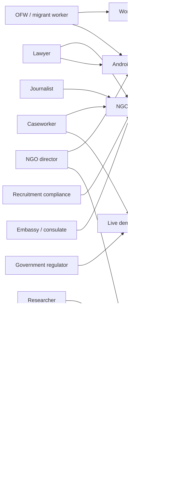
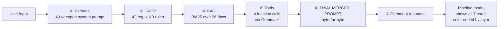
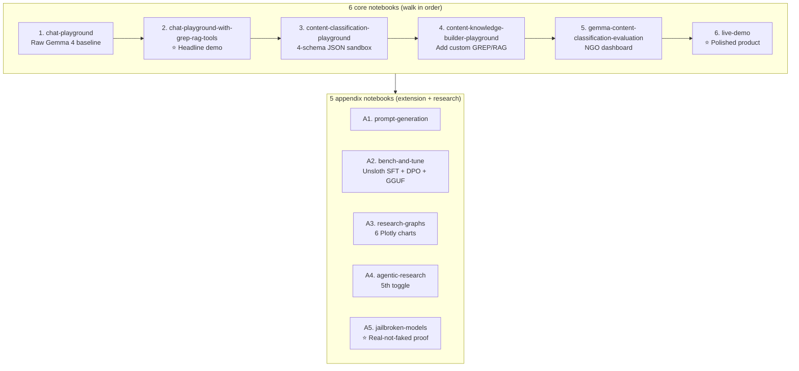
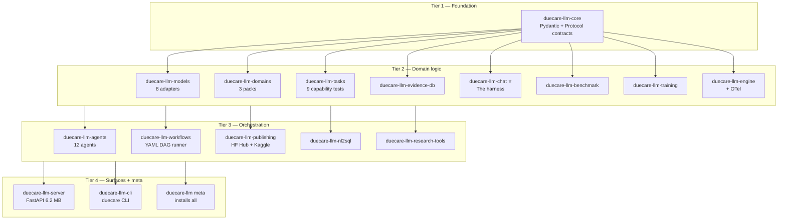
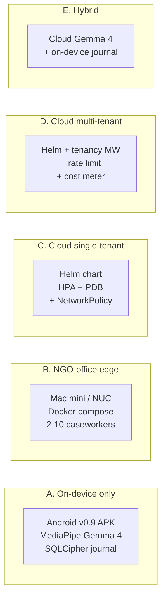

# System map — bird's-eye view of everything

> Single-page navigation map across **users, surfaces, harness, notebooks,
> packages, and deployments**. Use this to orient yourself before
> diving into any specific doc.
>
> **Interactive version:** [`system_map.html`](system_map.html) — click
> any node, filter by type. Lives under the same docs site.

## At a glance

| Dimension | Count |
|---|---:|
| User personas served | 14 |
| Product surfaces | 5 |
| Kaggle notebooks | 11 (2 core + 9 appendix) |
| PyPI packages | 17 |
| Deployment topologies | 5 |
| GREP rules | 42 |
| RAG documents | 26 |
| Migration corridors | 20 |
| ILO C029 indicators | 11 |
| Mean harness lift | +56.5 pp |

## Layer 1 — Users → Surfaces

## Layer 2 — The 4-layer harness (the technical core)

Every response shows a **▸ View pipeline** link opening the 7-card
modal — every byte the model saw is visible. That visualization IS
the demo.

## Layer 3 — Notebooks (the submission surface)

## Layer 4 — PyPI packages (17 wheels under `duecare.*` namespace)

Cross-layer imports flow **downward only** (per
[`.claude/rules/20_code_style.md`](https://github.com/TaylorAmarelTech/gemma4_comp/blob/master/.claude/rules/20_code_style.md))
— Tier 4 may import from Tier 1, never the reverse.

## Layer 5 — Deployment topologies (5 shapes)

Pick a topology with [`docs/deployment_topologies.md`](deployment_topologies.md).

## Cross-cutting threads

These aren't a layer — they cut across every layer:

| Thread | Where it lives |
|---|---|
| **Privacy** (anonymizer hard gate, audit log of hashes) | [`.claude/rules/10_safety_gate.md`](https://github.com/TaylorAmarelTech/gemma4_comp/blob/master/.claude/rules/10_safety_gate.md) · [`considerations/THREAT_MODEL.md`](considerations/THREAT_MODEL.md) |
| **Reproducibility** ((git_sha, dataset_version) provenance) | [`RESULTS.md`](https://github.com/TaylorAmarelTech/gemma4_comp/blob/master/RESULTS.md) · [`harness_lift_report.md`](harness_lift_report.md) |
| **Observability** (OTel + Prometheus + Loki + Grafana) | [`considerations/SLO.md`](considerations/SLO.md) · [`considerations/runbook.md`](considerations/runbook.md) |
| **Governance** (ADRs + threat model + compliance crosswalk) | [`adr/`](adr/) · [`considerations/`](considerations/) |
| **Cross-NGO trends** (federation w/o PII) | [`cross_ngo_trends_federation.md`](cross_ngo_trends_federation.md) |

## How to use this map

| If you are... | Click in order |
|---|---|
| A judge in a hurry | Stat cards → Layer 3 (notebooks) → [`FOR_JUDGES.md`](FOR_JUDGES.md) |
| A first-time deployer | Layer 1 (find your persona) → Layer 5 (pick topology) → relevant scenario |
| A contributor | Layer 4 (packages) → [`adr/`](adr/) → [`CONTRIBUTING.md`](https://github.com/TaylorAmarelTech/gemma4_comp/blob/master/CONTRIBUTING.md) |
| An academic | Layer 3 (notebooks A1–A3) → [`harness_lift_report.md`](harness_lift_report.md) → [`prompt_schema.md`](prompt_schema.md) |
| A journalist | Layer 1 (journalist node) → [`press_kit.md`](press_kit.md) → [`marias_case_end_to_end.md`](marias_case_end_to_end.md) |

## See also

- [`readiness_dashboard.md`](readiness_dashboard.md) — current submission readiness across every dimension
- [`authors_notes.md`](authors_notes.md) — informal observations + reflections from the author
- [`appendices/README.md`](appendices/README.md) — index of additional enclosures linked from the writeup
- [`writeup_draft.md`](writeup_draft.md) — the formal 1,500-word submission writeup
