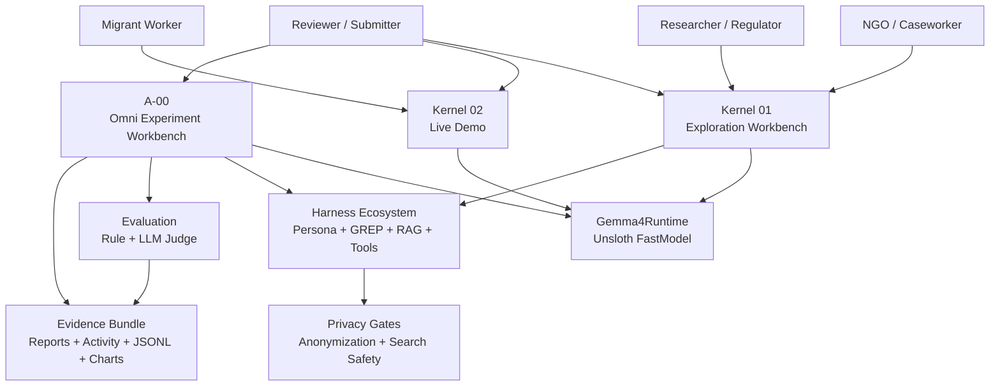

# DueCare System Map

Current as of 2026-05-17.

```mermaid
flowchart TD
    reviewer[Reviewer / Submitter]
    worker[Migrant Worker]
    ngo[NGO / Caseworker]
    researcher[Researcher / Regulator]

    k01[Kernel 01\nExploration Workbench]
    k02[Kernel 02\nLive Demo]
    a00[A-00\nOmni Experiment Workbench]

    runtime[Gemma4Runtime\nUnsloth FastModel]
    harness[Harness Ecosystem\nPersona + GREP + RAG + Tools]
    privacy[Privacy Gates\nAnonymization + Search Safety]
    eval[Evaluation\nRule + LLM Judge]
    exports[Evidence Bundle\nReports + Activity + JSONL + Charts]

    worker --> k02
    ngo --> k01
    researcher --> k01
    reviewer --> k01
    reviewer --> k02
    reviewer --> a00

    k01 --> runtime
    k02 --> runtime
    a00 --> runtime

    k01 --> harness
    a00 --> harness
    harness --> privacy
    a00 --> eval
    eval --> exports
    a00 --> exports
```

## Active Surfaces

| Surface | Purpose |
|---|---|
| `kaggle/01-duecare-exploration-workbench/` | Broad interactive harness workbench. |
| `kaggle/02-live-demo/` | Focused demo and video route. |
| `kaggle/_archive/notebooks/A-00-omni-experiment-workbench/` | Quantitative proof run and export bundle. |

The retired A-series notebook ladder is archived and is not the current
reviewer path.

## Contract Docs

- [`harness_ecosystem.md`](harness_ecosystem.md)
- [`harness_pattern.md`](harness_pattern.md)
- [`harness_standard_contract.md`](harness_standard_contract.md)
- [`model_loading_trace.md`](model_loading_trace.md)
